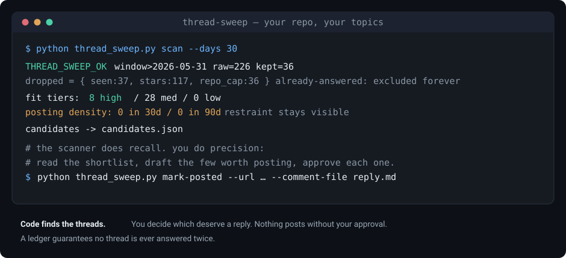

# signal-sweep

**Find the open GitHub threads your project's docs already answer, then answer them one at a time, on your terms.**



Maintainers answer the same questions over and over in scattered issues and discussions, while the people asking never find the docs that already solve their problem. signal-sweep closes that gap without turning you into a link-dropper: a deterministic scanner does the finding, you judge which threads deserve a reply, and nothing posts without your explicit per-comment approval. A ledger guarantees no thread is ever answered twice.

The scanner is recall; you are precision. That division is the whole design. Code is good at sweeping all of GitHub for candidate threads and terrible at knowing which ones your docs genuinely answer, so it never decides — it hands you a ranked shortlist and a running tally of how much you've posted lately, and you make every call.

[](LICENSE)  

## This is for you if

- You maintain an open-source project with real docs, a CLI, or a library.
- You keep seeing the same questions answered badly (or not at all) in other repos' issues and discussions.
- You want to help where it's asked without becoming the person every maintainer mutes.

If that's you, start with **thread-sweep**. The rest of the toolkit is below.

## thread-sweep, the one to start with

Point it at your repo and your topics. It finds open issues and discussions across GitHub whose problem a specific page of your docs already solves, filters out noise, and writes a ranked shortlist to `candidates.json`. You read it, draft the replies worth posting, and record each one.

```bash
cd modules/thread_sweep
cp config.example.json config.json    # your repo, your topics, your search phrasings
python thread_sweep.py scan --dry-run --days 30   # preview, no state written
python thread_sweep.py scan                       # real run: writes the shortlist, marks seen
python thread_sweep.py density                    # how much you've posted lately
```

`scan` prints a one-line summary of what it swept and kept:

```
THREAD_SWEEP_OK window>2026-06-28 raw=174 kept=44 dropped={'seen': 0, 'posted': 0, 'stars': 95, 'own': 0, 'dup': 6, 'repo_cap': 29} errors=0
fit tiers: 6 high / 38 med / 0 low
posting density: 0 in 30d / 0 in 90d
candidates -> candidates.json
```

From there you judge fit, draft the few replies worth making, and approve each post individually.

Two discovery lanes feed it: per-topic search phrasings run across all of GitHub, plus a pinned watchlist of repos whose audience overlaps yours. Filters run before anything reaches you — a star floor, a per-repo cap so one mega-repo can't flood the shortlist, your own repo and account excluded, everything already surfaced excluded, everything already *answered* excluded forever. When you post, record it:

```bash
python thread_sweep.py mark-posted --url <thread-url> --pattern <topic> --comment-file reply.md
```

The module [README](modules/thread_sweep/README.md) covers the lanes, the fit bar, and the etiquette in full. If you drive it with an agent, [SKILL.example.md](modules/thread_sweep/SKILL.example.md) is a working Claude Code skill with the approval gate spelled out. The shipped `config.example.json` is a real one: the topics the [agent-workspace-architecture](https://github.com/jimy-r/agent-workspace-architecture) project actually sweeps.

## The wider toolkit

thread-sweep is one of six modules on a shared pipeline (`signal → judge → gate → act → ledger`). Every outbound module shares the same gate shape and records to the same `modules/sweepcore.py` ledger format, so posting semantics stay identical by construction (placement-health is inward-facing and needs neither). Reach for the others once you've felt the need.

| Module | What it does |
|---|---|
| [`thread-sweep`](modules/thread_sweep/) | **Start here.** Open GitHub issues and discussions your docs already answer. |
| [`forum-sweep`](modules/forum_sweep/) | The same job beyond GitHub: Discourse vendor forums, Hacker News, Lobsters, and an opt-in discovery-only Reddit lane. |
| [`mention-sweep`](modules/mention_sweep/) | Where your project is already named or misdescribed across issues, discussions, and code. The entity-first complement to thread-sweep. |
| [`list-sweep`](modules/list_sweep/) | Curated lists and directories you could be listed in, with each one's intake mechanics (PR / issue-form / web-form) detected. |
| [`placement-health`](modules/placement_health/) | Watches the places you're already listed and reports when an entry is dropped or a link breaks. Inward-facing, no gate. |
| [`release-sweep`](modules/release_sweep/) | On a new release, assembles per-channel announcement material from the real diff for you to draft from. Gated per channel. |

[ROADMAP.md](ROADMAP.md) holds the direction and the explored-but-unscheduled tail. The toolkit is feature-complete and deliberately small; new modules arrive only when a real need pulls one in.

## Design principles

These are why it stays useful instead of becoming the next muted bot.

1. **Deterministic discovery, human judgment.** Code retrieves and filters. People decide what deserves an answer. An assistant may help score and draft, but its drafts go through the same gate as everything else.
2. **The gate is the feature.** No comment posts without explicit, individual approval. No batch mode, no auto-post flag, no scheduler. Tools that post on their own are why maintainers ban link-droppers, and GitHub's [Acceptable Use Policies](https://docs.github.com/en/site-policy/acceptable-use-policies/github-acceptable-use-policies) prohibit automated bulk activity that generates unsolicited content. The per-comment gate keeps every reply an individual, deliberate act.
3. **The answer is the payload; the link is garnish.** A reply must fully resolve the thread standing alone. If removing your link makes it a worse comment, don't post it.
4. **A ledger, so nothing doubles up.** Every posted reply is recorded. The scanner excludes answered threads forever, and posting density is reported on every run so restraint stays visible.
5. **Scarcity is the spam defence.** A few genuinely useful replies a month build standing. More spends it.

## Quick start

Requires Python 3.10+ and an authenticated [GitHub CLI](https://cli.github.com/) (`gh auth login`). No other dependencies — stdlib plus `gh`.

See the [thread-sweep](#thread-sweep-the-one-to-start-with) commands above. Every module follows the same shape: edit a small JSON config, dry-run, scan, judge, post the ones that clear your bar, record each.

## Contributing

Issues and PRs welcome, module ideas especially. One rule is non-negotiable: nothing that weakens the human gate (auto-post paths, batch approval, schedulers) gets merged. Contributor conventions live in [CLAUDE.md](CLAUDE.md).

## Built by

[James Ross](https://jamesross.ai) and [Justin Zingsheim](https://github.com/jtzingsheim1). signal-sweep grew out of the thread-sweep module in James's [agent-workspace-architecture](https://github.com/jimy-r/agent-workspace-architecture) workspace, generalized into a standalone toolkit.

## License

[MIT](LICENSE).
